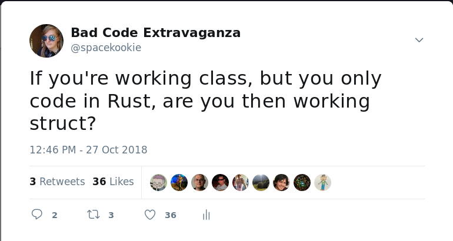
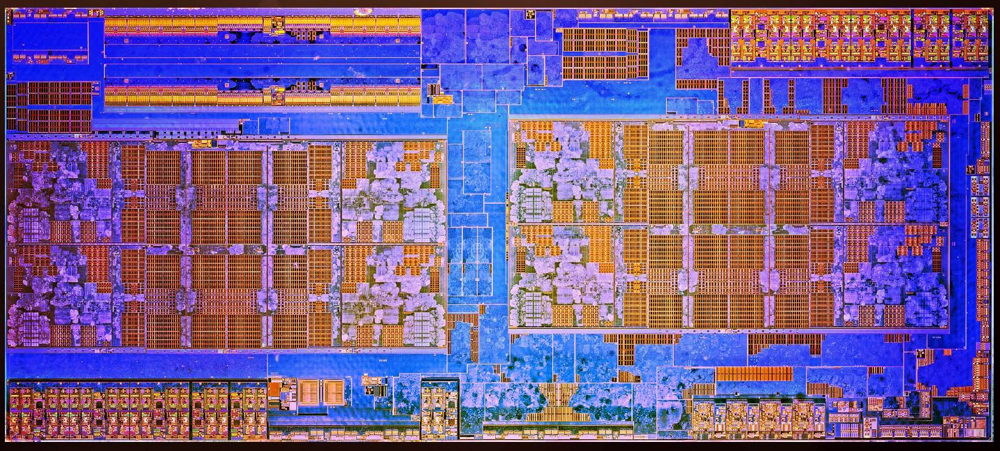
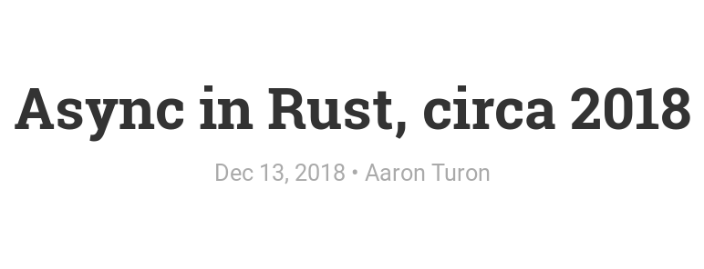

Привет RustRush 👋

---

---

## `$ whoami`

<br />

<br />

---

## Katharina Fey

`@spacekookie`

Software Engineer at Ferrous Systems

---

## How to complain at me

`kookie@spacekookie.de`

`@spacekookie` on twitter

---

I make some attrocious puns

---




---

---

An <u>async</u> story

---

An async <u>story</u>

---

## Rust is successful

---

How do you define success?

---

Rust is a young language

> * Development started in 2010
> * Stable since 2015

---

Rust communities are young

---

Yet, we have seen some amazing work from them

---

Lots of companies are adopting Rust

Finding Rust jobs is easier as ever

---

## Momentum

---


---

Every 6 weeks a new Rust.

Contribution pipeline is short

---

> [Rust] is fundamentally about empowerment: no matter what kind of code you are writing now, Rust empowers you to reach farther, to program with confidence in a wider variety of domains than you did before.

<small>-- Rust book, foreword</small>

---

## Is the Rust community unique?

---

## No

---

What is unique is how the language and tooling support the community in ways that other language ecosystems do not!

---

## Rust is going places

* Networking services
* Embedded
* Browser front-ends
* General applications
* Games
* Spaaaaaaaaaaaaaace!

---


---

A community of developers empowered by their tools and each other

---

In my opinion: <u>momentum</u> is <u>success</u>

Bringing new people to new domains

---

People who are curious and adventerous.

<div class="fragment" data-fragment-index="3">
Supported by their tools and the community,
</div>

<div class="fragment" data-fragment-index="4">
who are encouraged to build exciting things!
</div>

---

This isn't easy!

This isn't perfect!

---


* Problems scaling the descision process.
* Problems bringing in new people

---

---

## Rust 2018

---

Who here _doesn't_ know what Rust 2018 is?

---

## Rust 2018

* Accumulation of changes since 2015
* Backwards compatible with Rust 2015, while still having some breaking changes
* Focus on developer ergonomics and productivity

---

This is done via the edition flag

```toml
[package]
name = "foobar"
version = "1.0.0"
edition = "2018"
```

`2015` is default to preserve backwards compatibility

---

## The working groups

> * Commandline Applications
> * Embedded
> * WASM
> * Networking

---

## The idea

> The goal of these groups is to focus on the end-to-end user experience of using Rust in each domain.

<small>-- Announcing the 2018 Domain Working Groups</small>

---

## The Governance

> * Group leaders were assigned at first
> * People joined through collaboration
> * The longer time went on, the less hirarchical the group structures became

---

This meant a low barrier-to-entry for newcomers

---


---

---

> [...] focusing on the end-to-end experience for both sync and async networking code

---

## What is async I/O

---

Using available resources the most efficiently...

---



---

Doing things while waiting for long-running operations to finish...

---


---

## Look mum, no threads!


---


---

## Why?

---


---


## Futures

---


---

**`Future` = calculation that hasn't happened yet**

> * Is *probably* gonna happen at some point
> * Just keep asking

---

**Event Loop = runtime for `Future`s**

* Keeps polling `Future` until it is ready
* Runs your code whenever it can be run

---

## This is a talk about Rust

---

## It's state machines all the way down

```rust
// ... define `stdin` and `stdout`
let reader = BufReader::new(stdin);
let buffer = Vec::new();

let fut = io::read_until(reader, b'\n', buffer)
      .and_then(move |(stdin, buffer)| {
          stdout.write_all(&buffer).map_err(|e| panic!(e))
      }).map_err(|e| panic!(e));

// Actually run _here_
tokio::run(fut);
```

---

---

## Let's talk about some history

---

## Late 2013

---

### libgreen


* Rust had green threading support
* Enabled non-blocking IO

---

Included a runtime in `stdlib`

* This came with a lot of problems

---

Rust wanted to go in a different direction

---

## Late 2014

---

**`libgreen` is dead, long live `libgreen`**


---

## mio-rs

"Metal I/O" 🤘

---

* Light, non-blocking IO library
* Abstracts async over different platforms
* Eventually developed an ecosystem around it

---

## Mid 2016

---


---

* *zero cost abstraction* for futures
* Building async state-machines

---

### `tokio-core`

---

* Wraps around `mio.rs` and `futures.rs`
* Event reactor

---

## Fast foward to 2018

---

## So what's the problem?

---

```rust
// ... define `stdin` and `stdout`
let reader = BufReader::new(stdin);
let buffer = Vec::new();

let fut = io::read_until(reader, b'\n', buffer)
      .and_then(move |(stdin, buffer)| {
          stdout.write_all(&buffer).map_err(|e| panic!(e))
      }).map_err(|e| panic!(e));

// Actually run _here_
tokio::run(fut);
```

---

```rust
let reader = BufReader::new(stdin);
let mut buffer = Vec::new();

io::read_until(reader, b'\n', &mut buffer)?;
stdout.write_all(&buffer)?;
```

---

## `async` & `await`

---

Write code that looks synchronous/ blocking.

It actually does async under the hood!

---

## The Future trait

---

## The Future trait

```rust
enum Poll<T> {
    Ready(T),
    Pending
}

trait Future {
    type Output;
    fn poll(self: Pin<&mut Self>, lw: &LocalWaker) 
        -> Poll<Self::Output>;
}
```

<div class="fragment" data-fragment-index="3">
Now provided by `libcore`/ `libstd`
</div>

---

## New keywords for everybody

<br />

* `async` - marks a function as ... async
* `await` - waits for something async to happen

---

```rust
async fn read_and_print() -> Result<(), ::std::io::Error> {

    // ...
    
    await!(io::read_until(reader, b'\n, &mut buffer)?);

    await!(stdout.write_all(&buffer)?);
}
```

---

```rust
fn read_and_print() 
    -> impl Future<Output=Result<(), ::std::io::Error>>
{
    // ...
}
```

---

## `romio`

A minimal `tokio` fork that uses `async`/`await` 

```rust
async fn say_hello(mut s: TcpStream) { /* ... */ }

async fn listen() -> Result<(), ::std::io::Error>  {
    let socket_addr = "127.0.0.1:80".parse()?;
    let mut listener = TcpListener::bind(&socket_addr)?;
    let mut incoming = listener.incoming();
    
    // accept connections and process them serially
    while let Some(stream) = await!(incoming.next()) {
        await!(say_hello(stream?));
    }

    Ok(())
}
```

---

## Can I use this?

---

## Yes!

 <small>(on nightly)</small>

---

* RFC for async/await syntax
* `Future` trait now in `libcore`/ `libstd`
* `futures-rs` updated to the new APIs

---

## Networking WG

---

Writing networking code has many problem domains

---

> * Pure async/await implementation
> * "I just want to write a web-app"
> * Low-level embedded networking

---

## Working group mitosis

<br />

> * net-async-wg
> * net-web-wg
> * net-embedded-wg

---

## Recap

---



---

* Open RFC to stabilise `Future` trait
* Working on the ecosystem & libraries

---

## Why "an async story" ?

---

Kate, what hell was your point?

---


---

## Rust is the async story!

---

`async` in Rust 2018 is still WIP.

<div class="fragment" data-fragment-index="2">
But it's on a good track,
</div>

<div class="fragment" data-fragment-index="3">
because it's the community that's driving development!
</div>

---

Who makes Rust?

<div class="fragment" data-fragment-index="2">
All of you! All of us!
</div>

<div class="fragment" data-fragment-index="3">
And the language is better off because of it.
</div>

---

If you can remember one thing from this talk?

<div class="fragment" data-fragment-index="2">
Collaboration takes time.
</div>

<div class="fragment" data-fragment-index="3">
But the result will be amazing!
</div>

---

*thank you*

